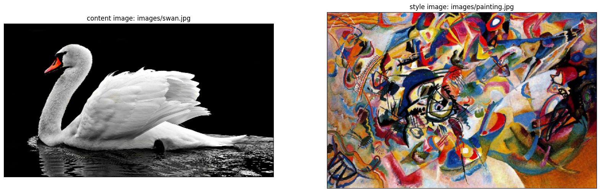
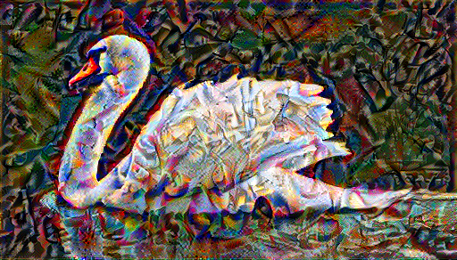

# NEURAL_STYLE_TRANSFER
Neural style transfer is a fascinating application of deep learning that blends the content of one image with the style of another to create a unique, stylized image. This project demonstrates the implementation of neural style transfer using a pre-trained [VGG19](https://keras.io/api/applications/vgg/#vgg19-function)
## Table of Contents
- [Description](#Description)
- [Advantages of Neural Style Transfer](#Advantages-of-Neural-Style-Transfer)
- [Methodology Behind Neural Style Transfer](#Methodology-Behind-Neural-Style-Transfer)
  - [Preprocess, content & style images](#Preprocess,-content-&-style-images)
  - [Load pre-trained VGG19 model](#Load-pre-trained-VGG19-model)
  - [Extracting style and content features](#Extracting-style-and-content-features)
  - [Define Loss Functions](#Define-Loss-Functions)
  - [Training and optimizing](#Training-and-optimizing)
- [Result](#Result)
## Description
This project leverages the power of convolutional neural networks (CNNs) to perform neural style transfer. The VGG19 model, pre-trained on the ImageNet dataset, is used to extract content and style features from images. By optimizing a target image to simultaneously match the content representation of one image and the style representation of another, the project produces a new image that combines the semantic content of the former with the artistic style of the latter.
## Advantages of Neural Style Transfer

1. **Creative Enhancement**:
   - Neural Style Transfer empowers artists and designers by allowing them to blend the content of one image with the style of another. This technique enables the creation of unique and visually stunning artwork that combines elements from different artistic styles.

2. **Efficiency and Automation**:
   - This technology automates the complex process of applying artistic styles to images, saving significant time and effort compared to manual methods. It allows for quick iterations and experimentation with various styles, which is especially beneficial in fast-paced game development environments.

3. **Versatility in Application**:
   - Neural Style Transfer can be applied to a wide array of image types, from photographs to digital art, making it a versatile tool in the creative industry.

4. **Consistency in Style Application**:
   - Ensures a consistent application of style across multiple images, which is crucial for maintaining a uniform aesthetic in a game’s visual design. This consistency helps in creating a cohesive and immersive game world that enhances player experience.

5. **Customization and Control**:
   - Offers adjustable parameters that allow users to control the intensity and specifics of the style transfer. This customization enables fine-tuning of the output to meet the desired artistic vision, providing flexibility and precision in the game development process.

6. **Accessibility to Non-Artists**:
   - Democratizes art creation by making advanced artistic techniques accessible to individuals without formal training in art. Game developers, including indie developers and smaller studios, can easily apply sophisticated styles to their game assets, fostering creativity and artistic expression among a broader audience.

7. **Innovative Media Applications**:
   - Widely used in various media industries, including film, advertising, and video games, to create unique visual effects and immersive environments.
    
8. **Interdisciplinary Integration**:
    - Can be integrated with other cutting-edge technologies such as virtual reality (VR), augmented reality (AR), and digital marketing. This integration creates innovative and immersive experiences that enhance player interaction and engagement in various fields, particularly in the dynamic world of game development.
  
## Methodology Behind Neural Style Transfer
- **Preprocess, content & style images**: Basically, downloading your content and style images.
- **Load pre-trained VGG19 model**:
  ```bash
  tmp_vgg = tf.keras.applications.vgg19.VGG19()
  ```
- **Extracting style and content features**:
  - For the style layers, we will use the first layer of each convolutional block. Also for each style layer we will use the gram matrix and store these results in a list.
 
    - The function for calculating the gram mmatrix is as follows:
      ```bash
      def gram_matrix(input_tensor):
      """ Calculates the gram matrix and divides by the number of locations
      Args:
      input_tensor: tensor of shape (batch, height, width, channels)

      Returns:
      scaled_gram: gram matrix divided by the number of locations
      """

      # calculate the gram matrix of the input tensor
      gram = tf.linalg.einsum('bijc,bijd->bcd', input_tensor, input_tensor)

      # get the height and width of the input tensor
      input_shape = tf.shape(input_tensor)
      height = input_shape[1]
      width = input_shape[2]

      # get the number of locations (height times width), and cast it as a tf.float32
      num_locations = tf.cast(height * width, tf.float32)

      # scale the gram matrix by dividing by the number of locations
      scaled_gram = gram / num_locations

      return scaled_gram
      ```
  - For the content layer, we will use the second convolutional layer of the last convolutional block (just one layer)
- **Define Loss Functions**:
  - Style Loss:
    ```bash
    def get_style_loss(features, targets):
    """Expects two images of dimension h, w, c

    Args:
    features: tensor with shape: (height, width, channels)
    targets: tensor with shape: (height, width, channels)

    Returns:
    style loss (scalar)
    """
    # get the average of the squared errors
    style_loss = tf.reduce_mean(tf.square(features - targets))

    return style_loss
    ```
  - Content Loss:
    ```bash
    def get_content_loss(features, targets):
    """Expects two images of dimension h, w, c

    Args:
    features: tensor with shape: (height, width, channels)
    targets: tensor with shape: (height, width, channels)

    Returns:
    content loss (scalar)
    """
    # get the sum of the squared error multiplied by a scaling factor
    content_loss = 0.5 * tf.reduce_sum(tf.square(features - targets))

    return content_loss
    ```
  - Total Loss:
    The total loss is given by $L_{total} = \beta L_{style} + \alpha L_{content}$, where $\beta$ and $\alpha$ are weights we will give to the content and style features to generate the new image.

- **Training and optimizing**: Now, we compute the gradient of loss with respect to generated image using `tf.gradientTape()` and similar to model training we will use an optimizer,`Adam()` here, to update the original image with the computed gradients.

  
## Result







